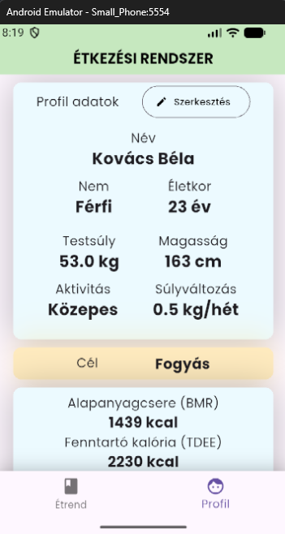
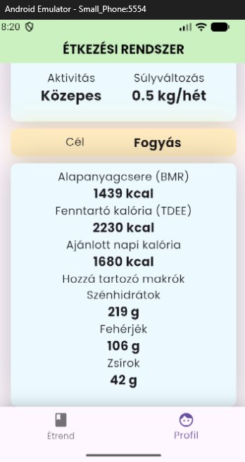
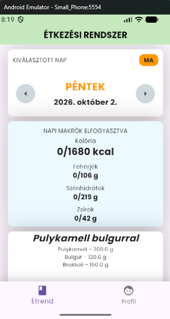

# Étkezési Rendszer

> Flutter / Dart alapú mobilalkalmazás személyre szabott kalória- és
> makrotápanyag-célok meghatározására, valamint napi étkezések és
> receptek kezelésére.

** A projekt jelenleg fejlesztés alatt áll.**

---

## A projektről

Az **Étkezési Rendszer** egy saját fejlesztésű Flutter mobilalkalmazás,
amelynek célja egy egyszerű, átlátható és személyre szabható
táplálkozási rendszer létrehozása.

Az alkalmazás a felhasználó alapadatai, aktivitási szintje és célja
alapján kiszámolja a napi energia- és makrotápanyag-szükségletet.

A projekt fejlesztése során a Flutter/Dart mellett kiemelt szerepet kap
az alkalmazáslogika, az adatmodellezés és a számítási folyamatok
elkülönítése a felhasználói felülettől.

---

## Jelenlegi funkciók

### Profil

A felhasználói profil jelenleg az alábbi adatokat kezeli:

- keresztnév és vezetéknév
- nem
- születési dátum
- testsúly
- magasság
- aktivitási szint
- cél
- heti célzott testsúlyváltozás

---

### Kalória- és energiaigény számítása

Az alkalmazás több egymásra épülő számítást végez:

**BMR (Basal Metabolic Rate)**

A nyugalmi energiafelhasználás a Mifflin–St Jeor képlet alapján kerül
kiszámításra.

**TDEE (Total Daily Energy Expenditure)**

A BMR érték az aktivitási szintnek megfelelő szorzóval kerül
módosításra.

**Napi kalóriacél**

A felhasználó célja és a heti célzott testsúlyváltozás alapján az
alkalmazás meghatározza a napi kalóriacélt.

A jelenlegi implementációban a számítás a következő közelítést használja:

- 1 kg testsúlyváltozás ≈ 7700 kcal
- a heti energiaigény-különbség napi értékre kerül átszámításra

---

### Makrotápanyagok

Az alkalmazás kiszámítja a napi célzott:

- fehérje
- szénhidrát
- zsír
- kalória

értékeket.

A jelenlegi logika például fogyási cél esetén a fehérjecélt
2 g/testsúlykilogramm értékkel számolja, majd a zsír és fehérje
kalóriatartalmának levonása után a fennmaradó energiából határozza meg
a szénhidrátcélt.

---

### Ételek és receptek

A projektben külön adatmodellek reprezentálják:

- ételeket
- makrotápanyagokat
- recepteket
- receptösszetevőket
- étkezéseket
- napokat
- felhasználókat

Az ételekhez jelenleg többek között az alábbi adatok tartoznak:

- név
- kategória
- kcal / 100 g
- fehérje / 100 g
- szénhidrát / 100 g
- zsír / 100 g
- ár / kg

A receptösszetevők gramm alapján történő makrotápanyag-számítása
külön logikában történik.

---

## Képernyőképek

### Profil és napi célok



### Napi étrend



### Napi nézet



> A projekt fejlesztése közben a felhasználói felület folyamatosan
> változik, ezért a képernyőképek az aktuális fejlesztési állapotot
> mutatják.

---

## Alkalmazás felépítése

A projektben az alkalmazáslogika és a felhasználói felület külön
részekre van szervezve.

```text
lib/
│
├── data/
│   ├── test_day.dart
│   ├── test_food.dart
│   ├── test_recipes.dart
│   └── test_user.dart
│
├── models/
│   ├── agecalc.dart
│   ├── BMRCalc.dart
│   ├── day.dart
│   ├── enums.dart
│   ├── food.dart
│   ├── macros.dart
│   ├── meal.dart
│   ├── recipe.dart
│   ├── recipeingredient.dart
│   ├── targetKcalCalc.dart
│   ├── targetMacrosCalc.dart
│   ├── TDEECalc.dart
│   └── user.dart
│
├── pages/
│   ├── etrend.dart
│   ├── navigation.dart
│   └── profil.dart
│
└── main.dart
```

### Főbb modellek

| Modell | Feladata |
|---|---|
| `User` | Felhasználói adatok és célok |
| `Food` | Élelmiszerek adatai |
| `Macros` | Kalória- és makrotápanyag-értékek |
| `Recipe` | Receptek és hozzávalók |
| `RecipeIngredient` | Recepthez tartozó alapanyag és mennyiség |
| `Meal` | Étkezések és receptek |
| `Day` | Egy adott nap étkezései és elfogyasztott makrói |

---

## Számítási logika

A számítások külön Dart fájlokban találhatók, így a számítási logika
nincs közvetlenül a UI-kódba építve.

```text
User
 │
 ├── életkor
 │
 ├── BMR
 │
 ├── aktivitási szint
 │       │
 │       ▼
 │      TDEE
 │
 ├── cél
 │
 └── heti testsúlyváltozás
          │
          ▼
     napi kalóriacél
          │
          ▼
     célzott makrók
```

Ez lehetővé teszi, hogy a számítási logika külön is tesztelhető és
később könnyebben módosítható legyen.

---

## Technológiák

- **Flutter**
- **Dart**
- **Material UI**
- **intl**
- **Git / GitHub**
- **Android Emulator**
- **Poppins** egyedi font

### Külső package-ek

```yaml
dependencies:
  flutter:
    sdk: flutter

  intl: ^0.20.2
  cupertino_icons: ^1.0.8
```

---

## UI és lokalizáció

Az alkalmazás saját Poppins betűtípust használ több súlyozással.

A dátumok magyar lokalizációja az `intl` package segítségével történik.

A jelenlegi UI főbb elemei:

- profilkártya
- napi étrend nézet
- kalória- és makrótápanyag-kártyák
- cél kijelzése
- alsó navigáció
- napi dátumnavigáció
- receptmegjelenítés

---

## Fejlesztési állapot

### Elkészült

- [x] Flutter projekt alapstruktúra
- [x] Profil oldal
- [x] Felhasználói adatmodell
- [x] Életkor számítása
- [x] BMR számítás
- [x] TDEE számítás
- [x] Napi kalóriacél számítása
- [x] Makrotápanyag-célok számítása
- [x] Étel adatmodell
- [x] Recept adatmodell
- [x] Receptösszetevők kezelése
- [x] Receptösszetevők makrószámítása
- [x] Napi étrend nézet
- [x] Napi dátumnavigáció
- [x] Magyar dátumformázás
- [x] Alsó navigáció
- [x] Egyedi Poppins font

### 🚧 Folyamatban / következő lépések

- [ ] Profiladatok szerkesztésének megvalósítása
- [ ] Ételek hozzáadása a napi étkezésekhez
- [ ] Elfogyasztott kalóriák követése
- [ ] Elfogyasztott makrotápanyagok követése
- [ ] Receptek részletes megjelenítése
- [ ] Recept makróinak teljes számítása
- [ ] Tartós adatmentés
- [ ] Adatbázis integráció
- [ ] Felhasználói autentikáció
- [ ] Saját receptek létrehozása
- [ ] Allergiák és nem kívánt ételek kezelése
- [ ] Napi költségkeret figyelembevétele
- [ ] Statisztikák és grafikonok
- [ ] Unit tesztek bővítése

---

## Tesztadatok

A jelenlegi verzió fejlesztési célú tesztadatokat használ.

A tesztadatok külön `data/` könyvtárban találhatók:

```text
lib/data/
├── test_day.dart
├── test_food.dart
├── test_recipes.dart
└── test_user.dart
```

Ez a projekt következő fejlesztési szakaszában tartós adattárolással és
felhasználói adatokkal váltható ki.

---

## Futtatás

### Előfeltételek

A projekt futtatásához szükséges:

- Flutter SDK
- Dart SDK
- Android Studio vagy VS Code
- Android Emulator vagy fizikai Android eszköz

### Repository klónozása

```bash
git clone https://github.com/patakimate2004/calorie-tracker-flutter.git
cd calorie-tracker-flutter
```

### Függőségek telepítése

```bash
flutter pub get
```

### Alkalmazás indítása

```bash
flutter run
```

---

## Fejlesztői cél

A projekt elsődleges célja egy teljes mobilalkalmazás fokozatos
felépítése Flutter és Dart használatával.

A fejlesztés során külön figyelmet kap:

- az objektumorientált adatmodellezés
- az üzleti logika elkülönítése a UI-tól
- újrafelhasználható modellek és számítások
- Flutter widget-alapú felhasználói felület
- fokozatos funkcióbővítés
- Git és GitHub használata
- tesztelhető és később bővíthető struktúra

---

## Projekt státusz

**Status: In Development**

Ez egy folyamatosan fejlesztett saját portfólióprojekt.

Az alkalmazás funkciói és felhasználói felülete a fejlesztés során
folyamatosan bővülnek.

---

## Author

**Pataki Máté**

GitHub:  
https://github.com/patakimate2004
